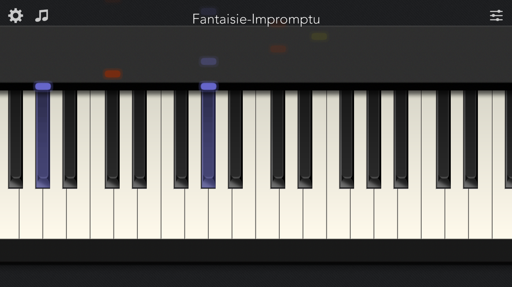

# Piano + JavaScript

This tutorial shows how to create a basic piano in JavaScript. All code on this page is MIT licensed. The source code [can be found here](https://github.com/ronyeh/piano/).

We will try to build a piano that looks something like this:



[Click here for a demo](https://squarepoet.github.io/piano/v1).

To follow along with this tutorial, install [the package from npm](https://www.npmjs.com/package/go-piano).

```
npm install go-piano
```

## Audio

First, we will need to play individual notes from our virtual piano. We can use a JS library for this. Here are two that are easy to use:

-   [Musical](https://github.com/PencilCode/musical.js)
-   [Tone](https://tonejs.github.io/)

```js
// Tone JS
// Play a middle 'C' for the duration of an 8th note
piano.triggerAttackRelease("C4", "8n");

// Musical JS
piano.tone("C", 1.0, 0.5);
```

## Graphics

Let's make some graphics for our piano. We will use SVG to draw the keys and body of the piano. If you want to skip this step, you can download a [simple image of a piano here](./i/piano-template-000001.png).

```js
// TODO
alert("Hello World");
```

## Interaction

Now we need to let the user interact with the piano, through the mouse and keyboard (or through tapping on a touch screen).

```js
// TODO
alert("Hello World");
```

### See

-   [JS Guitar](https://guitar.js.org/)
-   [JS Music Theory](https://music.js.org/)
